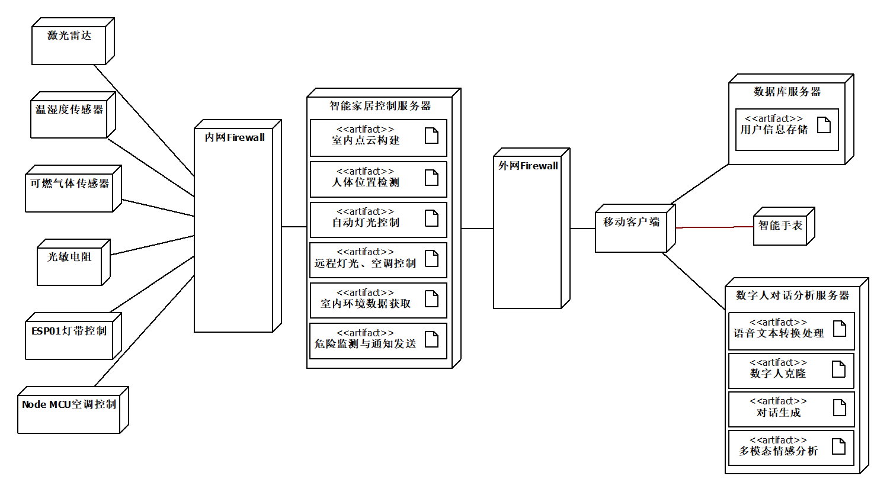

# 乐居巢-多模态情感分析模块

**乐居巢SmartNest** 是一个专为留守老人和儿童设计的智能家居及关怀系统。
这里,每个家都是温暖的港湾,每个人都被细心关怀。

- **智能家居**: 我们提供实时环境监测、自动灯光控制和远程设备操作,让生活更加舒适安全。
- 
- **情感关怀**: 利用多模态情感分析技术,实时了解留守老人与儿童的情绪状态,提供及时的情感支持。

- **数字人陪伴**: 通过AI驱动的数字人形象,为用户提供24/7的陪伴和交流。

- **健康监护**: 通过智能设备监测用户的生理指标,及时发现潜在的健康与安全问题。


**多模态情感分析模块** 是SmartNest系统的核心组件之一,旨在通过融合视频、音频和文本数据,全方位分析用户的情感状态。

- **多维度分析**: 结合面部表情、语音特征和语义内容,提供更全面准确的情感解读。

- **实时处理**: 支持实时视频流分析,及时捕捉用户情绪变化。

- **个性化模型**: 通过持续学习,不断优化对特定用户的情感识别精度。


## 技术栈

- **Flask**
- **PyTorch**
- **OpenCV**
- **OpenFace**
- **OpenSMILE**
- **BERT**

## 功能

- **视频特征提取**: 使用OpenFace提取面部表情特征。
- **音频特征提取**: 采用OpenSMILE提取音频声学特征。
- **文本特征提取**: 利用预训练的BERT模型进行文本编码。
- **多模态融合**: 设计了基于回归和分类的两个模型,综合分析多模态特征。
- **情感强度预测**: 输出情感强度得分,反映情绪的正负性及强度。
- **情感分类**: 将用户情绪归类为具体的情感类别(如:高兴、悲伤、愤怒等)。

## 在本地运行

- 安装Python依赖

```bash
  pip install -r requirements.txt
```

- 运行Flask应用（指定ip地址和端口号）

```bash
  gunicorn -w 4 -b 127.0.0.1:8000 app:app
```

## 系统部署结构




## 作者

- [@SheEagle](https://github.com/SheEagle)

  [](https://www.linkedin.com/in/xiru-wang-551103248/)

  [](https://github.com/SheEagle)


